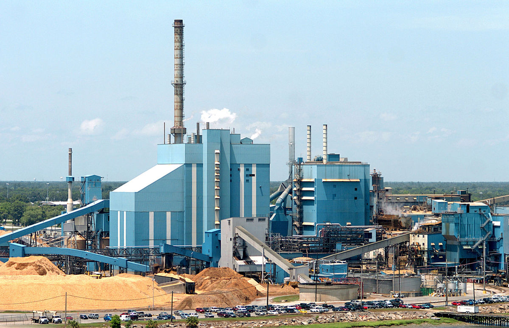
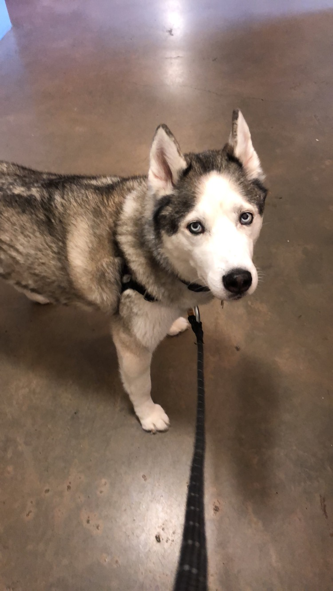

<!-- This won't be displayed but it will initialize your R session. Add any R libraries you need here. -->
```{r init,include=FALSE,echo=FALSE}
library(magrittr)

```


# Welcome!

<!-- You can include images saved within your repo... -->
```{r hello-world,echo=FALSE,fig.cap='Paper mill in Charleston, SC',fig.align='center',out.width='50%'}

```

What is the first thing you think of when you think Data Science? Based upon a very skewed survey of friends and family, most people think of Google, Facebook, computers, and technology. But ultimately, the data part of Data Science can be anything - and if it can be anything, why not manufacturing data? Most manufacturing facilities already collect mountains of data on their product and process. Their data just needs to be married to the tools of Data Science. In my ideas, I will outline some paths this union might take, focusing on the pulp and paper industry. 

<!-- Below this line is just examples of how you can embed video from Google Drive. First you have to enable sharing, then just get the object ID which is that long string between d/ and /preview and will also be appended to any sharing link you generate for your video. -->


### SmartMill

Leverage all of the tools and technology of data science to make your mill work smarter, harder, and better. SmartMill, a suite of tools and modules, will work to maximize mill earning potential without capital investment.

### SmartChem

A subsidiary of SmartMill, SmartChem focuses on impacting chemical usage. It utilizes machine learning to know how much of various chemicals are needed to meet quality requirements, while also preventing over use of chemicals and needless spending. 
  

## About the author

Hannah Morgan graduated from the University of Washington in 2015 with a Bachelors degree in Bioresource Science and Engineering and a Bachelor's degree in Chemical Engineering. She currently works for Capstone Technology, a small software firm based in Vancouver, WA, that builds data visualization software for industrial facilities. When not working she loves to hike around the PNW with her dog, Kei. 
<!-- You can include images saved within your repo... -->
```{r hello-world,echo=FALSE,fig.cap='Kei',fig.align='center',out.width='50%'}

```
*Updated: `r Sys.Date()`*
